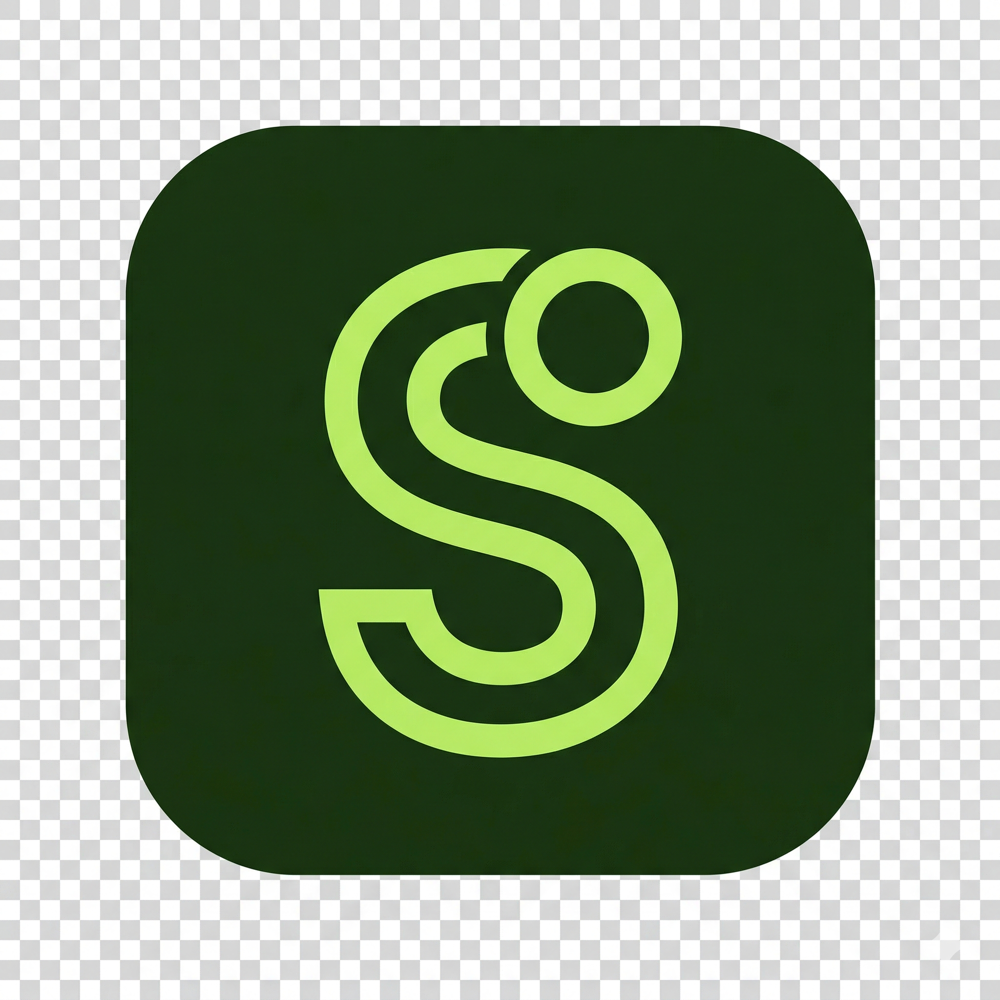

<div align="center">
  
  <h1>SubTrack</h1>
  <p>Track every expense — subscriptions included — and know exactly where your money goes.</p>

  <a href="https://subtrack-ten-azure.vercel.app">
    
  </a>
  &nbsp;
  
  &nbsp;
  
  &nbsp;
  
</div>

---

## What is SubTrack?

Most people can't say where their money actually goes. SubTrack logs every expense — one-off purchases and recurring subscriptions alike — in one place, converted to your currency using live exchange rates, so you get a clear, honest picture of your spending.

## Features

| | |
|---|---|
| 💸 **Expense tracking** | Log any spend, one-time or recurring, with date + optional time of day |
| 🔁 **Subscriptions** | Track recurring bills across weekly, monthly, quarterly, and yearly cycles |
| 💱 **Multi-currency** | Live exchange rates via open.er-api.com + Frankfurter fallback |
| 📊 **Dashboard** | Monthly burn, paid vs. remaining, upcoming bills |
| 📈 **Stats** | Yearly projection and category breakdown chart |
| 🗂️ **Categories** | Starter categories seeded on signup, plus custom ones created on the fly |
| 📶 **Offline-first** | Installable PWA — add expenses offline, synced automatically when back online |
| 📤 **Data export** | Download your transactions as CSV |
| 🔐 **Auth** | Email/password and Google OAuth via Supabase |
| 🔒 **Secure** | Row-level security, rate limiting, current password verification |

## Tech Stack

- **Framework** — [Next.js 16](https://nextjs.org) App Router (Server Components, Server Actions)
- **Database & Auth** — [Supabase](https://supabase.com) with RLS policies
- **Styling** — [Tailwind CSS v4](https://tailwindcss.com) with CSS custom properties
- **Language** — TypeScript (strict)
- **Forms** — React Hook Form + Zod validation
- **Charts** — Chart.js / react-chartjs-2
- **Offline** — Service worker + IndexedDB outbox for offline writes and background sync
- **Testing** — Vitest

## Getting Started

### Prerequisites

- Node.js 20.9+
- A [Supabase](https://supabase.com) project

### Local Setup

```bash
# 1. Clone the repo
git clone https://github.com/ZeeetOne/subtrack.git
cd subtrack

# 2. Install dependencies
npm install

# 3. Set up environment variables
cp .env.local.example .env.local
# Fill in your Supabase credentials
```

**.env.local**
```env
NEXT_PUBLIC_SUPABASE_URL=your_supabase_url
NEXT_PUBLIC_SUPABASE_ANON_KEY=your_supabase_anon_key
NEXT_PUBLIC_SITE_URL=http://localhost:3000
```

```bash
# 4. Start the dev server
npm run dev
```

Open [http://localhost:3000](http://localhost:3000)

> **Note on the database schema:** this repo's SQL migrations are kept out of
> version control on purpose, so the schema isn't exposed in a public repo.
> If you're the maintainer, apply your private migration backup to a fresh
> Supabase project. If you're forking or evaluating the code, you'll need to
> recreate the schema yourself — the tables it expects (`profiles`,
> `spend_categories`, `spend_rules`, `spend_entries`) and their shapes are
> visible in `src/lib/types.ts` and the queries in `src/lib/actions/`.

### Testing

```bash
npm run test   # Vitest unit tests
npm run lint   # ESLint
```

## Deployment

Deployed on Vercel. Set the three env vars above in your Vercel project settings, and configure your Supabase Auth **Site URL** and **Redirect URLs** to match your production domain.

[](https://vercel.com/new/clone?repository-url=https://github.com/ZeeetOne/subtrack)

---

<div align="center">
  <sub>Built with Next.js · Supabase · Tailwind CSS</sub>
</div>
